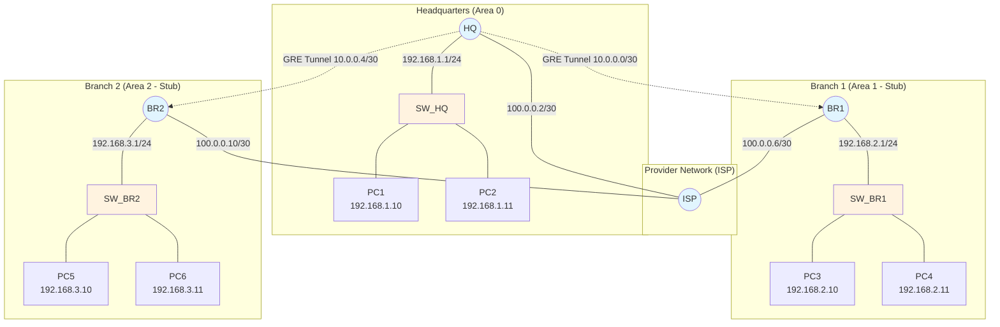

### 1. Тема
Построение защищённых каналов связи между филиалами организации с использованием туннелей GRE (Generic Routing Encapsulation) поверх сети провайдера и много-зонной маршрутизации OSPF.

### 2. Цель работы
- **Теоретическая:** Изучить принципы работы туннелей GRE, инкапсуляцию пакетов, взаимодействие с динамической маршрутизацией, а также основы IPsec для защиты туннелей.
- **Практическая:** Приобрести навыки настройки туннелей GRE на маршрутизаторах Cisco, организации много-зонного OSPF через туннели, настройки IPsec для шифрования GRE-трафика, проверки связности и анализа работы туннелей.

### 3. Задачи
1. Построить упрощённую сеть провайдера, к которой подключены центральный офис и два филиала.
2. Настроить IP-адресацию на всех интерфейсах устройств.
3. Настроить маршрутизацию в сети провайдера (статическую или динамическую) для обеспечения связности между офисами.
4. Настроить туннели GRE от каждого филиала до центрального офиса.
5. Настроить OSPF с несколькими зонами: центральный офис – Area 0, филиалы – stub-зоны.
6. Настроить IPsec для шифрования GRE-туннелей (дополнительное задание).
7. Проверить связность между компьютерами в разных филиалах через туннели.
8. Проанализировать таблицы маршрутизации и состояние туннелей.

### 4. Оборудование и программное обеспечение
- **Программное обеспечение:** Cisco Packet Tracer 8.x.
- **Оборудование (в эмуляторе):**
  - Маршрутизаторы Cisco 1941: 4 шт. (ISP – провайдер, HQ – центральный офис, BR1 – филиал 1, BR2 – филиал 2)
  - Коммутаторы Cisco 2960: 4 шт. (по одному в каждом офисе и 1 для эмуляции WAN)
  - Персональные компьютеры: 6 шт. (по два в каждом офисе)

### 5. Краткие теоретические сведения

**GRE (Generic Routing Encapsulation)** – протокол туннелирования, разработанный Cisco. Он инкапсулирует пакет одного протокола (например, IP) в пакет другого протокола, добавляя заголовок GRE. Позволяет передавать трафик между удалёнными сетями через транзитную сеть (например, Интернет). Туннель GRE – это виртуальный интерфейс типа point-to-point.

**Особенности GRE:**
- Не обеспечивает шифрования (данные передаются в открытом виде).
- Поддерживает multicast (в отличие от IPsec в транспортном режиме), поэтому может использоваться с OSPF, EIGRP и другими протоколами, требующими multicast.
- Увеличивает накладные расходы (заголовок GRE + внешний IP).

**IPsec (IP Security)** – набор протоколов для защиты IP-трафика. В данной работе IPsec используется в режиме туннеля для шифрования и аутентификации GRE-пакетов. Обычно применяется комбинация GRE over IPsec, где GRE обеспечивает инкапсуляцию multicast, а IPsec – шифрование.

**Много-зонный OSPF через GRE:** Туннели GRE представляют собой виртуальные каналы, которые можно включить в любую зону OSPF. В данной работе:
- Центральный офис (HQ) – Area 0.
- Филиал 1 (BR1) – Area 1 (stub).
- Филиал 2 (BR2) – Area 2 (stub).

Туннели от BR1 и BR2 до HQ будут входить в соответствующие зоны. Это позволит филиалам обмениваться маршрутами через HQ.

**Схема адресации:**
- Сеть провайдера: условная, например, 100.0.0.0/24 между ISP и офисами.
- Туннельные адреса: выделенная подсеть 10.0.0.0/30 для туннеля HQ-BR1, 10.0.0.4/30 для HQ-BR2.
- Локальные сети офисов: 192.168.1.0/24 (HQ), 192.168.2.0/24 (BR1), 192.168.3.0/24 (BR2).

### 6. Порядок выполнения работы

#### 6.1. Подготовительный этап
1. Запустите Cisco Packet Tracer.
2. Создайте новую рабочую область.
3. Добавьте оборудование согласно схеме (приложена к работе). Постройте сеть провайдера: будем использовать один маршрутизатор ISP с несколькими sub интерфейсами. 

**Таблица IP-адресации:**

| Устройство | Интерфейс | IP-адрес    | Маска подсети   | Назначение    |
| ---------- | --------- | ----------- | --------------- | ------------- |
| **ISP**    | Fa0/0.10  | 100.0.0.1   | 255.255.255.252 | К HQ          |
| ISP        | Fa0/0.20  | 100.0.0.5   | 255.255.255.252 | К BR1         |
| ISP        | Fa0/0.30  | 100.0.0.9   | 255.255.255.252 | К BR2         |
| **HQ**     | Fa0/0     | 100.0.0.2   | 255.255.255.252 | К ISP         |
| HQ         | Fa0/1     | 192.168.1.1 | 255.255.255.0   | LAN HQ        |
| HQ         | Tunnel 0  | 10.0.0.1    | 255.255.255.252 | Туннель к BR1 |
| HQ         | Tunnel 1  | 10.0.0.5    | 255.255.255.252 | Туннель к BR2 |
| **BR1**    | Fa0/0     | 100.0.0.6   | 255.255.255.252 | К ISP         |
| BR1        | Fa0/1     | 192.168.2.1 | 255.255.255.0   | LAN BR1       |
| BR1        | Tunnel 0  | 10.0.0.2    | 255.255.255.252 | Туннель к HQ  |
| **BR2**    | Fa0/0     | 100.0.0.10  | 255.255.255.252 | К ISP         |
| BR2        | Fa0/1     | 192.168.3.1 | 255.255.255.0   | LAN BR2       |
| BR2        | Tunnel 0  | 10.0.0.6    | 255.255.255.252 | Туннель к HQ  |

**Клиентские ПК:**
- HQ: PC1=192.168.1.10, PC2=192.168.1.11, шлюз 192.168.1.1
- BR1: PC3=192.168.2.10, PC4=192.168.2.11, шлюз 192.168.2.1
- BR2: PC5=192.168.3.10, PC6=192.168.3.11, шлюз 192.168.3.1

#### 6.2. Основной этап

##### Шаг 1. Настройка базовых параметров маршрутизаторов
- Присвойте имена устройствам (ISP, HQ, BR1, BR2).
- Отключите DNS lookup: `no ip domain-lookup`.

##### Шаг 2. Настройка сети провайдера (ISP)
- Настройте SW_ISP: создайте VLAN 10, 20, 30; порты направленные к BR1, BR2, HQ настройте в Access с соответствующим VLAN; порт направленный к ISP настройте в trunk. 
- ISP обеспечивает IP-связность между HQ, BR1 и BR2. (но не между подсетями филиалов!)

```
enable
configure terminal
hostname ISP
!
interface FastEthernet0/0.10
 encapsulation dot1Q 10
 ip address 100.0.0.1 255.255.255.252
 no shutdown
!
interface FastEthernet0/0.20
 encapsulation dot1Q 20
 ip address 100.0.0.5 255.255.255.252
 no shutdown
!
interface FastEthernet0/0.30
 encapsulation dot1Q 30
 ip address 100.0.0.9 255.255.255.252
 no shutdown
!
end
write memory
```

##### Шаг 3. Настройка маршрутизатора центрального офиса (HQ)
На HQ необходимо настроить:
- Интерфейс к провайдеру.
- LAN-интерфейс.
- Два туннеля GRE (до BR1 и до BR2).
- OSPF в зоне 0.

```
enable
configure terminal
hostname HQ
!
interface FastEthernet0/0
 ip address 100.0.0.2 255.255.255.252
 no shutdown
!
interface FastEthernet0/1
 ip address 192.168.1.1 255.255.255.0
 no shutdown
!
! Туннель к BR1
interface Tunnel0
 ip address 10.0.0.1 255.255.255.252
 tunnel source FastEthernet0/0
 tunnel destination 100.0.0.6   ! WAN-адрес BR1
 no shutdown
!
! Туннель к BR2
interface Tunnel1
 ip address 10.0.0.5 255.255.255.252
 tunnel source FastEthernet0/0
 tunnel destination 100.0.0.10   ! WAN-адрес BR2
 no shutdown
!
! OSPF
router ospf 1
 router-id 1.1.1.1
 network 192.168.1.0 0.0.0.255 area 0
 network 10.0.0.0 0.0.0.3 area 0   ! Tunnel0
 network 10.0.0.4 0.0.0.3 area 0   ! Tunnel1
!
! Маршрут по умолчанию к провайдеру (опционально)
ip route 0.0.0.0 0.0.0.0 100.0.0.1
!
end
write memory
```

##### Шаг 4. Настройка маршрутизатора филиала BR1
На BR1:
- Интерфейс к провайдеру.
- LAN-интерфейс.
- Туннель GRE до HQ.
- OSPF в зоне 1 (stub).

```
enable
configure terminal
hostname BR1
!
interface FastEthernet0/0
 ip address 100.0.0.6 255.255.255.252
 no shutdown
!
interface FastEthernet0/1
 ip address 192.168.2.1 255.255.255.0
 no shutdown
!
! Туннель к HQ
interface Tunnel0
 ip address 10.0.0.2 255.255.255.252
 tunnel source FastEthernet0/0
 tunnel destination 100.0.0.2   ! WAN-адрес HQ
 no shutdown
!
! OSPF
router ospf 1
 router-id 2.2.2.2
 network 192.168.2.0 0.0.0.255 area 1
 network 10.0.0.0 0.0.0.3 area 1
 area 1 stub
!
! Маршрут по умолчанию к провайдеру
ip route 0.0.0.0 0.0.0.0 100.0.0.5
!
end
write memory
```

##### Шаг 5. Настройка маршрутизатора филиала BR2
Аналогично, но с адресами для зоны 2.

```
enable
configure terminal
hostname BR2
!
interface FastEthernet0/0
 ip address 100.0.0.10 255.255.255.252
 no shutdown
!
interface FastEthernet0/1
 ip address 192.168.3.1 255.255.255.0
 no shutdown
!
! Туннель к HQ
interface Tunnel0
 ip address 10.0.0.6 255.255.255.252
 tunnel source FastEthernet0/0
 tunnel destination 100.0.0.2
 no shutdown
!
! OSPF
router ospf 1
 router-id 3.3.3.3
 network 192.168.3.0 0.0.0.255 area 2
 network 10.0.0.4 0.0.0.3 area 2
 area 2 stub
!
ip route 0.0.0.0 0.0.0.0 100.0.0.9
!
end
write memory
```

##### Шаг 6. Настройка клиентских ПК
- HQ: PC1 – 192.168.1.10/24, шлюз 192.168.1.1; PC2 – 192.168.1.11/24, шлюз 192.168.1.1.
- BR1: PC3 – 192.168.2.10/24, шлюз 192.168.2.1; PC4 – 192.168.2.11/24, шлюз 192.168.2.1.
- BR2: PC5 – 192.168.3.10/24, шлюз 192.168.3.1; PC6 – 192.168.3.11/24, шлюз 192.168.3.1.

##### Шаг 7. Проверка работы туннелей и OSPF
1. На HQ выполните:
   ```
   show ip interface brief
   show ip ospf neighbor
   show ip route ospf
   ```
   В соседях OSPF должны быть BR1 и BR2 (через туннельные интерфейсы).

2. На BR1:
   ```
   show ip ospf neighbor
   show ip route
   ```
   В таблице маршрутизации должен быть маршрут по умолчанию (0.0.0.0/0) от HQ и маршруты к другим сетям (192.168.1.0/24, 192.168.3.0/24).

3. Проверьте связность:
   - С PC1 (192.168.1.10) выполните ping до PC3 (192.168.2.10).
   - С PC1 до PC5 (192.168.3.10).
   - С PC3 до PC5.

##### Шаг 8. Настройка IPsec для защиты GRE-туннелей (дополнительное задание)
Для шифрования трафика GRE можно использовать IPsec в режиме туннеля. Ниже приведена настройка на HQ и BR1 для защиты туннеля Tunnel0. Аналогично для BR2.

**На HQ:**
```
! Настройка ISAKMP (IKE) политики
crypto isakmp policy 10
 encr aes
 authentication pre-share
 group 2
!
crypto isakmp key GRE-IPSEC-KEY address 100.0.0.6
!
! Настройка IPsec transform set
crypto ipsec transform-set GRE-TRANSFORM esp-aes esp-sha-hmac
 mode tunnel
!
! Настройка профиля IPsec для привязки к туннелю
crypto ipsec profile GRE-PROFILE
 set transform-set GRE-TRANSFORM
!
! Применение профиля к туннельному интерфейсу
interface Tunnel0
 tunnel protection ipsec profile GRE-PROFILE
```

**На BR1 (аналогично, но с адресом HQ 100.0.0.2):**
```
crypto isakmp policy 10
 encr aes
 authentication pre-share
 group 2
!
crypto isakmp key GRE-IPSEC-KEY address 100.0.0.2
!
crypto ipsec transform-set GRE-TRANSFORM esp-aes esp-sha-hmac
 mode tunnel
!
crypto ipsec profile GRE-PROFILE
 set transform-set GRE-TRANSFORM
!
interface Tunnel0
 tunnel protection ipsec profile GRE-PROFILE
```

После настройки IPsec трафик GRE будет шифроваться. Проверить можно с помощью `show crypto isakmp sa` и `show crypto ipsec sa`.

#### 6.3. Контрольный этап
1. Убедитесь, что туннели GRE находятся в состоянии up/up.
2. Проверьте таблицы OSPF: на BR1 должна быть только одна межзонная сеть (default route), если зона stub настроена корректно.
3. Выполните traceroute от PC3 до PC5, чтобы увидеть путь через HQ.
4. При включённом IPsec проверьте, что пакеты шифруются (можно использовать debug или захват трафика в симуляции).
5. Сохраните конфигурации.

### 7. Контрольные вопросы
1. Какие преимущества даёт использование туннелей GRE по сравнению с прямыми соединениями?
2. Почему для передачи маршрутной информации (OSPF) через GRE не требуется дополнительной настройки multicast?
3. Как OSPF узнаёт о существовании туннельных интерфейсов?
4. Что произойдёт, если туннель GRE будет настроен с неправильным source или destination?
5. Зачем в зонах филиалов используется тип stub? Как это влияет на таблицу маршрутизации?
6. Какие параметры необходимо согласовать на обоих концах GRE-туннеля?
7. В чем отличие IPsec в транспортном режиме от туннельного? Какой режим используется в дополнительном задании?
8. Как проверить, что IPsec шифрует трафик GRE?
9. Может ли OSPF работать без туннелей, напрямую через сеть провайдера? Какие проблемы могут возникнуть?
10. Какие ещё протоколы туннелирования существуют (L2TP, PPTP, IP-in-IP)? В чем их особенности?

### 8. Содержание отчета
- Титульный лист.
- Тема, цель и задачи работы.
- Схема сети с указанием всех IP-адресов и туннельных подсетей.
- Таблица IP-адресации.
- Конфигурации всех маршрутизаторов (ISP, HQ, BR1, BR2) – листинги running-config.
- Результаты проверки:
  - Вывод `show ip interface brief` на HQ.
  - Вывод `show ip ospf neighbor` на HQ и BR1.
  - Вывод `show ip route ospf` на BR1.
  - Результаты ping между ПК разных филиалов.
  - (Для доп. задания) Вывод `show crypto isakmp sa` и `show crypto ipsec sa`.
- Ответы на контрольные вопросы.
- Выводы по работе.

### 9. Схема сети (Mermaid)



### 10. Литература
1. Одом У. "Официальное руководство Cisco по подготовке к сертификации CCNA". – М.: Вильямс, 2016.
2. Cisco Documentation: "Configuring GRE Tunnels" (cisco.com).
3. Cisco Documentation: "Configuring IPsec VPN" (cisco.com).
4. RFC 2784 – Generic Routing Encapsulation (GRE).
5. RFC 4301 – Security Architecture for IP (IPsec).

### 11. Критерии оценки
- Корректность построения топологии и IP-адресации: 15%
- Настройка сети провайдера и связности офисов: 15%
- Настройка туннелей GRE: 25%
- Настройка много-зонного OSPF (зона 0, stub): 25%
- Работоспособность связности между филиалами: 10%
- (Доп.) Настройка IPsec: +10% (бонус)
- Оформление отчета и ответы на вопросы: 10%

### 12. Важные примечания
- В Packet Tracer убедитесь, что используемые маршрутизаторы поддерживают команды `tunnel source`, `tunnel destination` и `tunnel protection ipsec`.
- Для IPsec в Packet Tracer могут потребоваться более новые версии; в версиях 8.x обычно поддерживается.
- При настройке stub-зон убедитесь, что на всех маршрутизаторах зоны (включая ABR – HQ) указано `area X stub`. В HQ для зон 1 и 2 также нужно добавить `area 1 stub` и `area 2 stub`.
- В HQ в OSPF необходимо добавить сети туннелей в соответствующие зоны. Для зоны 1 – это сеть Tunnel0, для зоны 2 – Tunnel1.
- Проверьте, что на HQ есть маршруты до WAN-адресов филиалов (они есть через интерфейс Fa0/0, так как сети прямые).
- Если туннель не поднимается, проверьте:
  - Доступность destination IP (ping).
  - Правильность указания source и destination.
  - Отсутствие ACL, блокирующих протокол GRE (IP protocol 47).