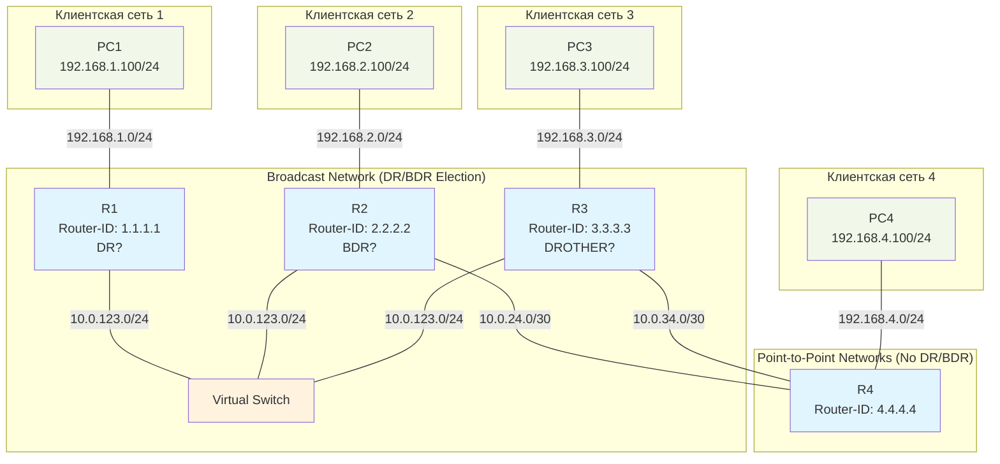

### **1. Тема**
Настройка и анализ протокола динамической маршрутизации OSPF (Open Shortest Path First) в одной зоне с использованием различных типов сетей: Broadcast и Point-to-Point.

### **2. Цель работы**
- **Теоретическая:** Изучить принципы работы протокола OSPFv2, процесс установления соседства (adjacency), выбор DR/BDR в broadcast-сетях, формирование базы данных состояний каналов (LSDB) и типы LSA.
- **Практическая:** Приобрести навыки настройки OSPF в FRR на различных типах интерфейсов, управления параметрами OSPF (reference bandwidth, аутентификация), а также анализа служебного трафика OSPF с помощью Wireshark.

### **3. Задачи**
1.  Развернуть сложную сетевую топологию с помощью Containerlab, включающую broadcast-сегмент и point-to-point соединения.
2.  Настроить базовую IP-адресацию и интерфейсы на маршрутизаторах FRR.
3.  Настроить OSPF в зоне 0 на всех маршрутизаторах с учетом типа сети (broadcast/point-to-point).
4.  Реализовать аутентификацию OSPF с использованием простого текстового пароля (clear-text).
5.  Изменить параметр `auto-cost reference-bandwidth` для корректного расчета метрик в гигабитных сетях.
6.  Проверить установление соседства (neighbor adjacency), состояние базы данных LSDB и таблицы маршрутизации.
7.  Захватить и проанализировать служебные пакеты OSPF (Hello, LSU с LSA Type 1 и Type 2).

### **4. Оборудование и программное обеспечение**
- **Программное обеспечение:** Containerlab, Docker, FRR (образ `frrouting/frr:latest`), Wireshark/Edgeshark.
- **Оборудование (виртуальное):**
  - Маршрутизаторы FRR: 4 шт. (R1, R2, R3, R4)
  - Клиентские хосты (контейнеры Alpine): 4 шт. (PC1, PC2, PC3, PC4)
  - Виртуальные коммутаторы (Linux bridge): 1 шт. (для эмуляции broadcast-сегмента)

### **5. Краткие теоретические сведения**

**OSPF (Open Shortest Path First)** — протокол динамической маршрутизации, основанный на алгоритме состояния каналов (Link-State). Маршрутизаторы обмениваются **LSA (Link State Advertisement)** для построения общей **LSDB (Link State Database)**. На основе LSDB с помощью алгоритма Дейкстры вычисляется кратчайший путь до каждой сети.

**Типы сетей OSPF:**
- **Broadcast (тип сети по умолчанию для Ethernet):** Для уменьшения служебного трафика выбираются **DR (Designated Router)** и **BDR (Backup DR)**. DR генерирует **LSA Type 2 (Network LSA)** для описания сегмента многоадресной рассылки.
- **Point-to-Point:** DR/BDR не выбираются. Каждый маршрутизатор формирует прямую связь с соседом.

**Важные параметры:**
- **Router ID:** Уникальный 32-битный идентификатор маршрутизатора в формате IP-адреса.
- **Hello/Dead Intervals:** Таймеры для поддержания соседства.
- **Аутентификация:** Защита обновлений маршрутизации (в работе используем простую текстовую).
- **Reference Bandwidth:** Параметр (по умолчанию 100 Мбит/с) для расчета метрики на основе пропускной способности интерфейса. В гигабитных сетях требуется увеличивать.

**Ключевые LSA для Area 0:**
- **LSA Type 1 (Router LSA):** Описывает состояние интерфейсов (линков) маршрутизатора. Генерируется каждым роутером.
- **LSA Type 2 (Network LSA):** Описывает сегмент broadcast/ NBMA сети. Генерируется только DR.

### **6. Порядок выполнения работы**

#### **6.1. Подготовительный этап**
1.  Создайте директорию для работы: `mkdir ~/lab2_ospf && cd ~/lab2_ospf`
2. Установите Open vSwitch `sudo pacman -S openvswitch`
3. Запустите ovs service:
```bash
systemctl start ovs-vswitchd ovsdb-server
systemctl enable ovs-vswitchd ovsdb-server
```
4. Добавьте виртуальный коммутатор `sudo ovs-vsctl add-br SW1`
5. Создайте каталоги для хранения конфигураций, с файлами `daemons` включающими демоны `zebra` и `ospfd`:
```bash
mkdir -p config/R{1..4} && printf "zebra=yes\nospfd=yes\n" | tee config/R{1..4}/daemons > /dev/null
chmod -R 777 config
```
6.  Создайте файл `topology.yaml` со следующей топологией:

```yaml
name: lab2-ospf

topology:
  nodes:
    SW1:
      kind: ovs-bridge
    R1:
      kind: linux
      image: frrouting/frr:latest
      binds:
        - ./config/R1:/etc/frr
    R2:
      kind: linux
      image: frrouting/frr:latest
      binds:
        - ./config/R2:/etc/frr
    R3:
      kind: linux
      image: frrouting/frr:latest
      binds:
        - ./config/R3:/etc/frr
    R4:
      kind: linux
      image: frrouting/frr:latest
      binds:
        - ./config/R4:/etc/frr

    PC1:
      kind: linux
      image: alpine:latest
      exec:
        - ip addr add 192.168.1.100/24 dev eth1
    PC2:
      kind: linux
      image: alpine:latest
      exec:
        - ip addr add 192.168.2.100/24 dev eth1
    PC3:
      kind: linux
      image: alpine:latest
      exec:
        - ip addr add 192.168.3.100/24 dev eth1
    PC4:
      kind: linux
      image: alpine:latest
      exec:
        - ip addr add 192.168.4.100/24 dev eth1

  links:
    # Broadcast-сегмент между R1, R2, R3
    - endpoints: ["SW1:eth1","R1:eth1"]
    - endpoints: ["SW1:eth2","R2:eth1"]
    - endpoints: ["SW1:eth3","R3:eth1"]

    # Point-to-Point соединения (эмулируем PPP) между R4-R2 и R4-R3
    - endpoints: ["R4:eth1", "R2:eth2"]
    - endpoints: ["R4:eth2", "R3:eth2"]

    # Клиентские подсети
    - endpoints: ["R1:eth2", "PC1:eth1"]
    - endpoints: ["R2:eth3", "PC2:eth1"]
    - endpoints: ["R3:eth3", "PC3:eth1"]
    - endpoints: ["R4:eth3", "PC4:eth1"]
```

#### **6.2. Основной этап**
1.  **Развертывание стенда:** `sudo containerlab deploy -t topology.yaml`
2.  **Настройка базовой IP-адресации на R1-R4 (пример для R1):**
    - `docker exec -it clab-lab2-ospf-R1 bash`
    - `vtysh`
    ```text
    conf t
    interface eth1
     ip address 10.0.123.1/24
     no shutdown
    exit
    interface eth2
     ip address 192.168.1.1/24
     no shutdown
    exit
    ```

    **Адресация для настройки:**
    - **Broadcast-сегмент (10.0.123.0/24):** R1: `.1`, R2: `.2`, R3: `.3`
    - **P2P R4-R2 (10.0.24.0/30):** R2: `.1`, R4: `.2`
    - **P2P R4-R3 (10.0.34.0/30):** R3: `.1`, R4: `.2`
    - **Клиентские сети:** как указано в топологии.

3.  **Настройка OSPF на R1-R4 (пример для R1):**
    ```text
    router ospf
     ospf router-id 1.1.1.1
     network 10.0.123.0/24 area 0
     network 192.168.1.0/24 area 0
     auto-cost reference-bandwidth 1000
    exit
    ```
    - Для **R2 и R3:** аналогично, но добавьте сети P2P-линков к R4.
    - Для **R4:** настройте OSPF только на P2P-интерфейсах и клиентской сети. **ВАЖНО:** На интерфейсах `eth1` и `eth2` (P2P) укажите тип сети: `ip ospf network point-to-point`.

4.  **Настройка аутентификации OSPF (на примере broadcast-сегмента):**
    - На R1, R2, R3 в интерфейсе `eth1`:
    ```text
    interface eth1
     ip ospf authentication
     ip ospf authentication-key SECRET_OSPF_PASS
    ```
    - В режиме `router ospf` добавьте команду `area 0 authentication` для включения аутентификации на уровне зоны.

5.  **Проверка настройки:**
    - `show ip ospf neighbor` – проверка соседства.
    - `show ip ospf interface [ifname]` – детали OSPF на интерфейсе (увидите тип сети, таймеры, роль DR/BDR).
    - `show ip ospf database` – просмотр LSDB. Найдите LSA Type 1 и Type 2.
    - `show ip route ospf` – проверка полученных через OSPF маршрутов.

6.  **Захват и анализ трафика OSPF:**
    - Запустите edgeshark `edgashark-up`
	- Запустите захват трафика на требуемом интерфейсе
    - Используйте фильтр `ospf`. Найдите и проанализируйте:
        - **Hello-пакеты:** Обратите внимание на поля `Network Mask`, `Hello Interval`, `Router Priority`, `Designated Router`.
        - **LS Update (LSU):** Раскройте пакет, найдите вложенные **LSA Type 1 (Router LSA)** – посмотрите поля `Link Type`, `Link ID`, `Link Data`.
        - **LSA Type 2 (Network LSA):** Если R1 стал DR/BDR, вы увидите этот тип. Обратите внимание на поле `Network Mask` и список `Attached Router`.

#### **6.3. Контрольный этап**
1.  Проверьте сквозную связность: `ping` с PC1 (192.168.1.100) на PC4 (192.168.4.100).
2.  Сохраните конфигурации всех роутеров (`write memory`).
3.  Сделайте скриншоты ключевых выводов команд.
4.  Уничтожьте стенд: `sudo containerlab destroy -t topology.yaml`

### **7. Контрольные вопросы**
1.  Объясните, почему в broadcast-сети необходим выбор DR/BDR? Что произойдет, если DR выйдет из строя?
2.  Почему на PPP-соединениях (point-to-point) не выбираются DR/BDR?
3.  Какая команда в FRR заставляет интерфейс считаться point-to-point для OSPF? В чем практическая разница в поведении?
4.  Какой процесс OSPF инициирует генерацию LSA Type 2 и какие маршрутизаторы в этой лаборатории должны его генерировать?
5.  Для чего изменялся параметр `auto-cost reference-bandwidth`? Какова формула расчета метрики OSPF по умолчанию?
6.  Каковы недостатки аутентификации с использованием простого текстового пароля (clear-text)? Какой более безопасный метод поддерживает OSPF?
7.  По данным из Wireshark, определите Router ID маршрутизаторов, которые стали DR и BDR в сегменте 10.0.123.0/24. От чего зависел этот выбор?
8.  В LSA Type 1 от R4, какие типы линков (Link Type) указаны для соединений с R2 и R3? Как это связано с типом сети?
9.  Какой командой можно принудительно задать Router ID, и почему это считается хорошей практикой?
10. Проанализируйте таблицу маршрутизации на R4. Сколько маршрутов получено через OSPF и как они помечены?

### **8. Содержание отчета**
- Тема, цель, задачи.
- **Схема сети (Mermaid диаграмма, см. ниже).**
- Листинг файла `topology.yaml`.
- Таблицы назначенных IP-адресов.
- Конфигурации OSPF для всех маршрутизаторов (вывод `show running-config`).
- Результаты проверки:
    - Вывод `show ip ospf neighbor` для каждого роутера.
    - Вывод `show ip ospf interface eth1` для R1 (с указанием роли).
    - Вывод `show ip ospf database` для R1 (кратко).
    - Вывод `show ip route ospf` для R4.
    - Результат проверки связности PC1 -> PC4.
- Скриншот из Wireshark с выделенным Hello-пакетом и полем DR.
- Скриншот из Wireshark с раскрытым LSA Type 1 и LSA Type 2.
- Ответы на контрольные вопросы.
- Выводы.

### **9. Схема сети (Mermaid диаграмма)**


