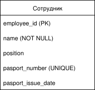
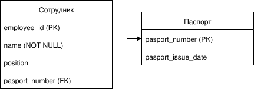
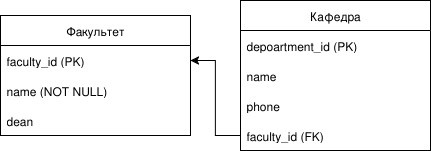
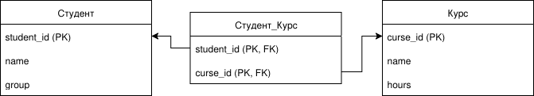
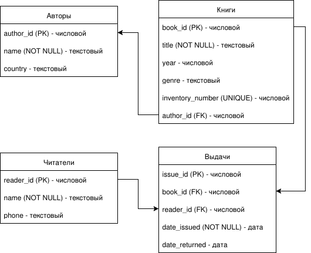

**Тема:** "Построение логической схемы базы данных на основе ER-диаграммы"

## **Цель работы:**
Научиться преобразовывать концептуальную ER-модель в логическую схему реляционной базы данных, понимая правила преобразования различных типов связей.

---

## **Теоретическая часть**

### **1. Соответствие между ER-диаграммой и логической схемой**

### **2. Правила преобразования связей**

#### **Связь 1:1 (один-к-одному)**
**Пример:** "Паспорт ↔ Человек"

**Способ преобразования:** Объединение в одну таблицу или создание внешнего ключа в одной из таблиц

#### **Связь 1:M (один-ко-многим)**
**Пример:** "Кафедра ↔ Преподаватели"

**Правило:** В таблице на стороне "многих" создается внешний ключ на таблицу "одного"

#### **Связь M:N (многие-ко-многим)**
**Пример:** "Студенты ↔ Курсы"

**Правило:** Создается промежуточная таблица-связка с двумя внешними ключами

---

## **Практическая часть**

### **Задание для студентов**

**На основе вашей ER-диаграммы из первой работы выполните:**

### **Часть 1: Преобразование сущностей в таблицы**

Для каждой сущности создайте таблицу в графическом виде:

**Условные обозначения:**
- **(PK)** - первичный ключ
- **(FK)** - внешний ключ  
- **(NOT NULL)** - обязательное поле
- **(UNIQUE)** - уникальное значение
- **→** - ссылка на другую таблицу

### **Часть 2: Преобразование связей**

#### **Для связи 1:1**
Вариант А - объединение в одну таблицу:

Вариант Б - разделение с внешним ключом:

#### **Для связи 1:M**
В таблице на стороне "многих" добавляем внешний ключ:

#### **Для связи M:N**
Создаем таблицу-связку:

### **Часть 3: Определение ограничений и типов данных**

Для каждого поля укажите:
- **Тип данных** (текстовый, числовой, дата)
- **Ограничения** (PK, FK, NOT NULL, UNIQUE)
- **Ссылки** на другие таблицы

Пример:

### **Часть 4: Построение полной схемы**

Создайте полную графическую схему, соединив все таблицы и показав связи между ними.

---

## **Пример выполнения работы**

### **Логическая схема для "Библиотека"**

---

## **Требования к оформлению работы**

1. **Четкое графическое представление** всех таблиц
2. **Указание для каждого поля**:
   - Название
   - Тип ключа (PK/FK)
   - Ограничения (NOT NULL, UNIQUE)
   - Тип данных
3. **Стрелки для визуализации связей** между таблицами
4. **Подписи типов связей** (1:1, 1:M, M:N)
5. **Аккуратность и читаемость** схемы

---

## **Контрольные вопросы**

1. **В чем основное различие между концептуальной и логической моделью?**
2. **Как преобразуется связь "многие-ко-многим" в логической схеме?**
3. **В какой таблице размещается внешний ключ при связи "один-ко-многим"?**
4. **Что обозначают обозначения PK, FK, NOT NULL, UNIQUE?**
5. **Когда целесообразно объединять таблицы при связи 1:1?**
6. **Как handledть атрибуты, которые относятся к связи между сущностями?**
