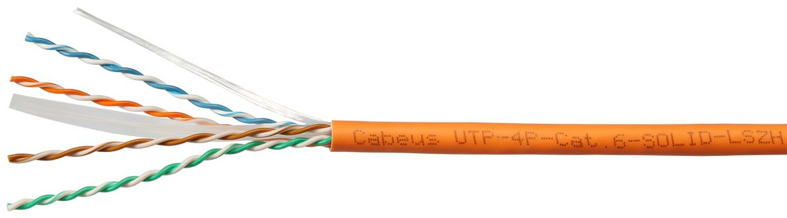

## **Цель работы:**
1. Изучить конструкцию и маркировку кабелей «витая пара».
2. Сравнить характеристики кабелей разных категорий.
3. Рассчитать ключевые параметры: сопротивление, максимальную длину сегмента.
## **Задания**:
### **1. Изучение конструкции кабеля**
1. Найдите в интернете схемы поперечного сечения кабелей:
- UTP (неэкранированный).
- FTP (с общим экраном).
- STP (экранирование каждой пары).
2. Составьте таблицу, указав для каждого типа:
- Количество пар.
- Материал проводников.
- Тип экранирования.
- Наличие дренажного провода.

**Пример таблицы:**

| Тип кабеля | Обозначение по стандарту ISO/IEC 11801 | Количество пар | Материал проводников | Экранирование | Дренажный провод | Прочие ообенности |
| ---------- | -------------------------------------- | -------------- | -------------------- | ------------- | ---------------- | ----------------- |
|            |                                        |                |                      |               |                  |                   |
### **2. Анализ маркировки**
1. Расшифруйте маркировку для каждого кабеля:
- Тип кабеля
- Категория (Cat5e, Cat6 и т.д.).
- Диаметр жилы (AWG).
- Тип оболочки (LSZH, PVC).
- Стандарт (например, TIA/EIA-568).
    2. Определите максимальную частоту и скорость передачи данных для каждого кабеля.
    
    
    

### **3. Сравнение категорий кабелей**
    1. Заполните таблицу, используя данные стандартов:

    | Категория | Макс. частота (МГц) | Скорость (Гбит/с) | Тип экранирования | Макс. длина сегмента (м) |
    | --------- | ------------------- | ----------------- | ----------------- | ------------------------ |
    | Cat5e     |                     |                   |                   |                          |
    | Cat6      |                     |                   |                   |                          |
    | Cat6a     |                     |                   |                   |                          |
    | Cat7      |                     |                   |                   |                          |

    2. Объясните, почему для Cat6 максимальная длина сегмента сокращается при высокой скорости передачи данных.
### **4. Определение максимальной длины сегмента**
    3. Для кабеля **Cat5e** с допустимым затуханием **24 дБ** (на 100 МГц) рассчитайте максимальную длину, если затухание на 1 метр составляет **0.24 дБ/м**:
    $$
    L_{\text{max}} = \frac{\text{Допустимое затухание}}{\text{Затухание на 1 м}}
    $$
    4. Для кабеля **Cat6** (затухание **21.3 дБ/100 м** на 250 МГц) определите, какую длину можно использовать для передачи 10 Гбит/с, если допустимое затухание — **24 дБ**.
### **5. Расчет сопротивления кабеля**
    5. Для медного проводника **24 AWG** (диаметр жилы **0.51 мм**) рассчитайте сопротивление на **100 метров**.
    - Удельное сопротивление меди: $$ \rho = 0.0175\, \text{Ом·мм}^2/\text{м} $$
    - Сопротивление:  $$
    R = \rho \cdot \frac{L}{S}
    $$
    6. Сравните результат с табличным значением для 24 AWG.
    7. Расчитайте соротивление медного проводника для **23 AWG**, **25 AWG**
### **Контрольные вопросы:**
    8. Почему в кабелях Cat7 используется двойное экранирование (S/FTP)?
    9. Как диаметр жилы (AWG) влияет на сопротивление кабеля?
    10. Почему максимальная длина сегмента Cat6 для 10 Гбит/с меньше, чем для Cat6a?
    11. Что означает маркировка **LSZH** и где такие кабели применяются?
    12. Зачем в витой паре скручивают проводники?
